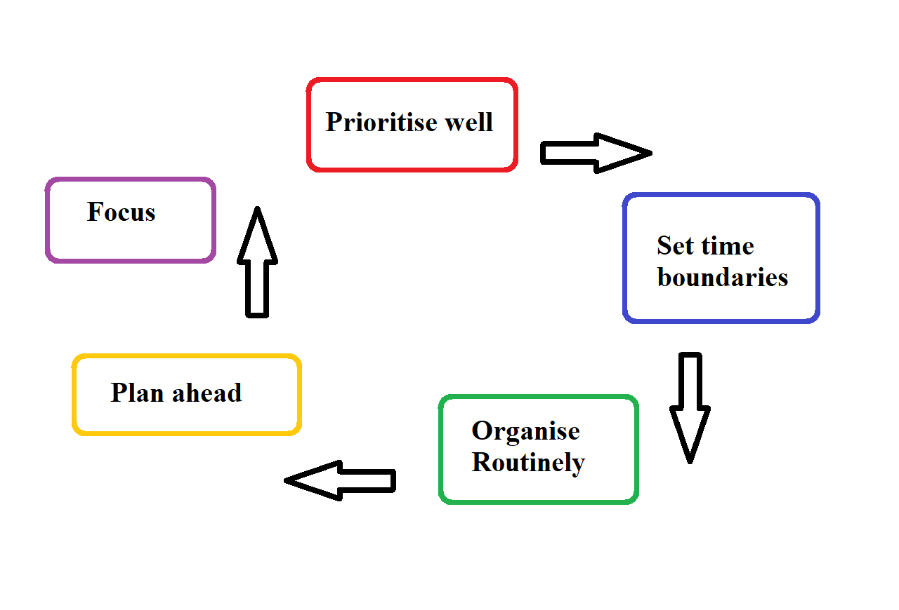

# Time and Task management

### Pareto principle
- Input ~~always equal~~ Output
- 20% causes could create 80% of consequences

### Eisenthower model
- Using time efficiently, not just effectively
- Prioritise **important** tasks over **urgent** tasks 
- 	|Important | Not important
--------|-----------|------------
Urgent | 1st priority | 3rd priority
--------|------------|-----------------
Not urgent | 2nd priority | 4th priority

### Productivity maximisation

- Two Minutes rule
