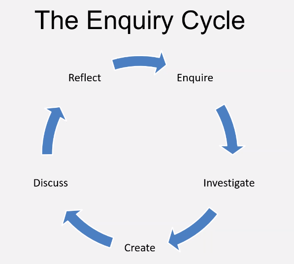

# Critical Thinking

### Levels of Intellectual Skill
- ------------**Evaluate**------------
-   ---------**Synthesize**---------
-     --------**Analyse**---------
-       -------**Apply**--------
-         ---**Understand**---
-           --**Remember**--

### Critical thinking process

Identify --> Analyse --> Apply

### Modes of thinking
- Divergent
- Convergent
- Lateral (Uses both)

### 6 thinking hats
- White - Analyze
- Read - Intuition
- Black - Pessimism
- Yellow - Optimism
- Green - Creativity
- Blue - Controlling

### Incorrect attitudes
- Ignorant certainty
- Naive Relativism

### Enquiry cycle

### Basic argument structure
- **Claim**
  - Present argument in clear statement
- **Evidence**
  - Present evidence that supports claim
- **Impact***
  - Explain significance of evidence

### Logical fallacies to look for
- Failure to deliver promises
- Assertiveness
- Contradiction
- Compare the conclusion to reality

### The art of Persuasion
#### 3 Pillars of Rhetoric
- **Ethos**
  - Appealing through Authority
- **Pathos**
  - Appealing through Emotional empathy
- **Logos**
  - Appealing through Logic and Reasoning

"Don't raise your voice, improve your argument" - Desmond Tutu

