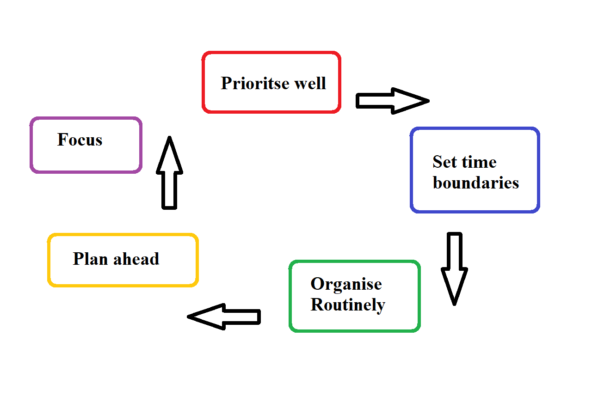

# Time and Task management

### Pareto principle
- Input ~~always equal~~ Output
- 20% causes could create 80% of consequences

### Eisenthower principle
- Using time efficiently, not just effectively
-Prioritise **important** tasks over **urgent** tasks 

- Two Minutes rule
